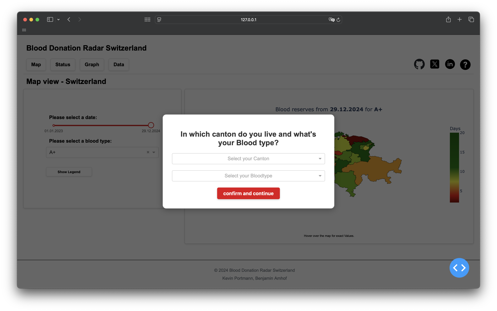
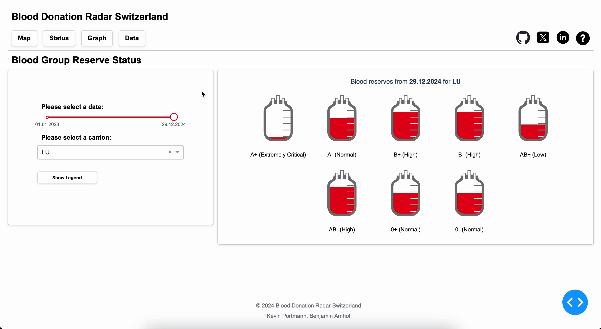

# Blood Donation Radar - Switzerland

<p align="center">   
    
</p>

## Introduction

Welcome to the Blood Donation Radar - Switzerland Dashboard! <br>
We, Benjamin and Kevin, are students in direction Artificial Intelligence and Mashine Learning at the HSLU and this is our project for the module Data Visualization.
The project contains a Dashboard ....

## Walkthrough
To show you the main features, here is a quick walkthrough of our dashboard.

### Landing view
You can start by selecting the canton you live in and your blood type. This will set the filters to your preferences. The filters can also be changed in the dashboard. <br>
<p align="center">
    
</p>

### Map view
Shows an overview of the blood reserves in days for all of Switzerland by canton. <br>
<p align="center">
    
</p>

### Status view
Displays the status of blood reserves by canton for all blood groups.<br>
<p align="center">
    
</p>

### Graph view
Shows graphs for all blood groups and by selected cantons for a selected time period. The threshold line makes it easy to see on which dates the blood shortage occurred. <br>
<p align="center">
    
</p>

### Data view
The datatable can be found here and can also be exported as a CSV file. <br>
<p align="center">
    
</p>

## To run the app locally
To run the Dashboard locally, you can clone this repository and run the app:
```bash
git clone https://github.com/kportmann/blood-donation-radar.git
cd blood-donation-radar
python3 -m venv venv && . venv/bin/activate
pip install -r requirements.txt
python3 app.py
```
### Have fun trying out!

